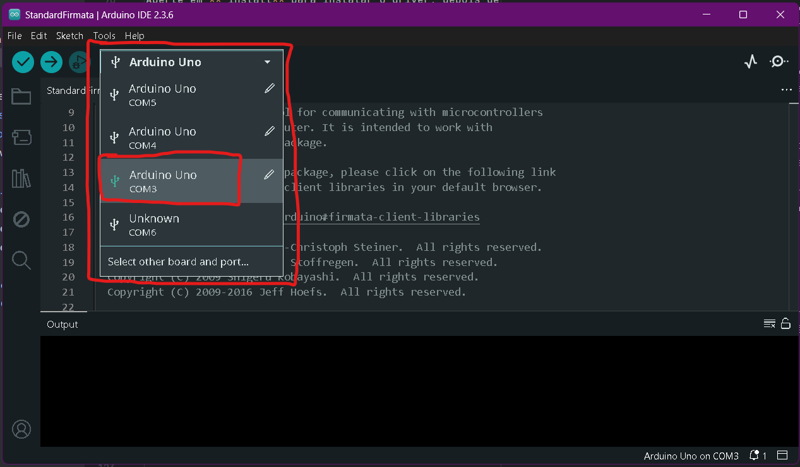
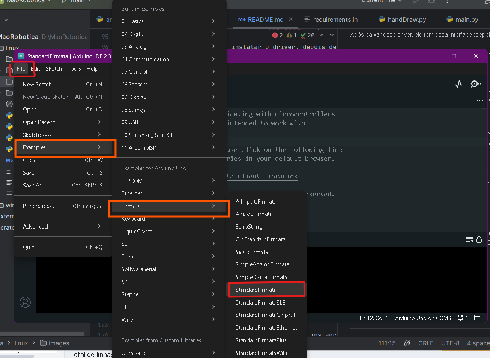
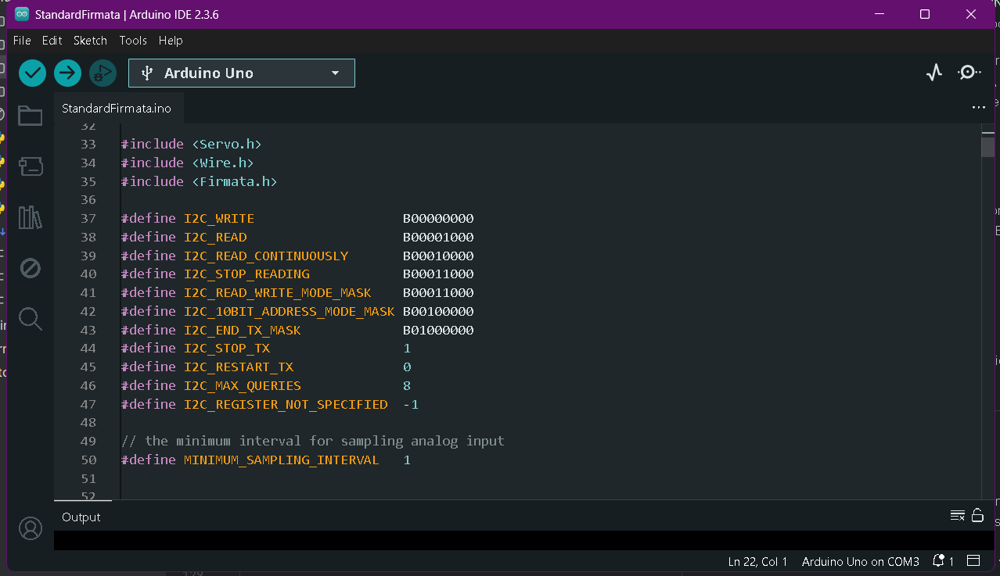
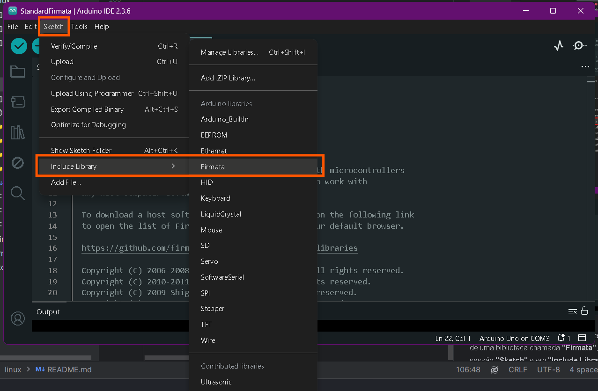

# Mao_Robotica
Criação de uma mão robótica que se espelha nos movimentos da mão humana para o projeto de extensão de robótica.
---------------------------------------------

## Iniciar Projeto ##

### Criando ambiente virtual isolado ###
Primeiro precisamos criar umm ambiente virtual(venv) para manter um ambiente isolado com todas nossas dependências do projeto
Para criar a venv, ultilize o seguinte comando na raiz do projeto:
```commandline
python -m venv .venv
```

Após isso, inicialize a venv agora e toda vez que for entrar no projeto, pois aqui ficará tudo que o projeto precisa para funcionar:
1. Linha de comando:
```commandline
source .venv/bin/activate
```

> [!NOTE]
> **Você deve ter o Python instalado para ultilizar todos esses comandos e esse projeto**.
------------------------------------------------
### Instalando dependências ###
Começando instalando **requirements-dev.txt** que contém o **pip-tools**, ferramenta util para ultilizar comandos de terminal no projeto

```commandline
pip install -r requirements-dev.txt
```

O arquivo **requirements.txt** agora pode ser instalado com todas as dependências do projeto
```commandline
pip install -r requirements.txt
```


Agora todas as dependências para o projeto em Python rodar estão instaladas no seu ambiente virtual!
----------------------------------------------

### Instalando dependências do Arduino Uno ###

----------------------------------------------

> [!NOTE]
> **Você deve baixar o Arduino IDE para ltilizar todos esses passos de configuração do arduino uno projeto**.
> Baixe o [Arduino IDE](https://www.arduino.cc/en/software/)

________________________________________________________________

### Permissão para Usuário usar Porta serial e câmera Linux ###

________________________________________________________________

O Arduino precisa da porta serial para ser utilizado, para isso você precisa dar permissão para seu usuário linux

Para ver as permissões dele, utilize o comando:

````commandline
ls -l /dev/ttyUSB*
````

A saída mostrará algo como crw-rw---- 1 root dialout .... Isso significa que o grupo é dialout, porém pode ser qualquer outro grupo.

Agora para passar seu usuário para permissão da porta serial, utilize o comando:

````commandline
sudo usermod -a -G dialout $USER
````

Você também precisssará permitir o seu usuário linux a acessar o dispositivo de vídeo, para poder abrir a câmera do seu computador

Para vizualizar se você tem permissão para acessar a câmera, utilize o código:

````commandline
getent group video
````

Esse comando vai listar algo como: /dev/video* ( * = 0, por exemplo)

Para permitir o acesso, use o seguinte comando com seu usuário linux (coloque "video0" caso seja seu dispositivo de vídeo e mude "$USER" para seu usuário:
````commandline
sudo usermod -a -G video $USER
````


> [!WARNING]
> Geralmente, esse driver gera bastante problemas com quem usa arduino. Entre diversas falhas e tentativas, descobri que o driver **CH340 V3.5.1.2019** é oq menos dá problema. Você pode baixar ele [aqui](https://www.visualmicro.com/page/CH340-Driver-Fix-Installation.aspx)

Após baixar esse driver, ele tem essa interface (depois coloco)

Aperte em **"install** para instalar o driver, depois de instalar, conecte o arduino e entre na barra de pesquisa do seu computador digite e entre em **"Gerenciador de Dispositivos"**
(colocar imagem)

Aqui vá em **"Portas(COM e LPT)"**, identifique se há algo como "**USB-SERIAL CH340(COM3)**", se não, repita o processo e reinicie o computador.

#### Arduino IDE código: ####

No Arduino IDE selecione a placa como **"Arduino UNO"** e a porta **COM3**, se for outra porta, localize no código **Python** e altere ela.


Adicione um código de exemplo que vai funcionar para o Python se comunicar normalmente com a placa Arduino Uno, vá em **"File"**, **"Examples"**, **"Firmata"** e selecione a opção **"StandardFirmata"**.


Ela deve gerar um código como:



Como dito, para o Arduino se comunicar com o Python, precisamos de uma biblioteca chamada **"Firmata"**, você insere ela na IDE na sessão **"Sketch"** e em **"Include Library"**, selecione **Firmata**

Ela deve incluir no início do código algo como:



Após tudo isso, rodar o programa python deverá funcionar normalmente com o arduino.

----------------------------------------------------------
 ## Agradecimentos ##

Gostaria de agradecer a todos que votaram no meu instagram sobre a dúvida do tamanho dos dedos, vocês foram importantes para esse projeto!!\
\
Se no final vc n ficou com o tamanho dos dedos mais votado não te preocupa, no próximo projeto iremos imprimir uma mão para representar você! :-)
> [!NOTE]
> inclusive a de dedos de tamanhos iguais, muita gente me mandou isso e eu simplesmente n pensei nessa hipótese 😓

